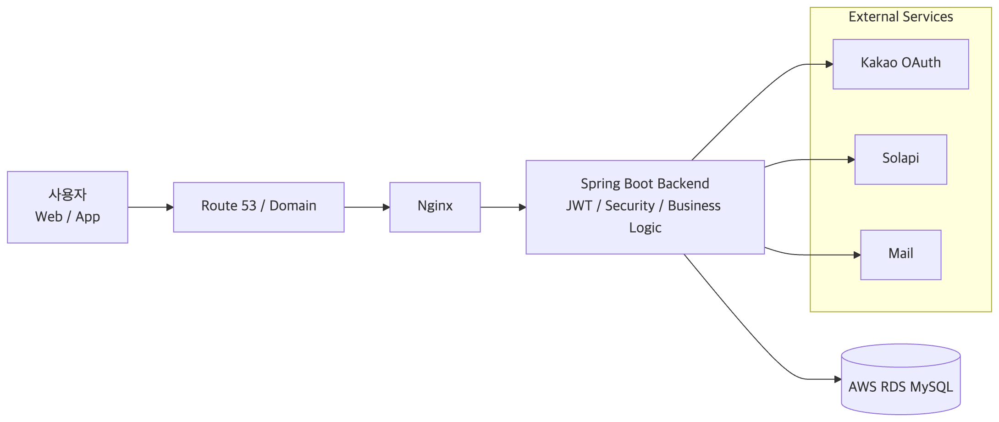
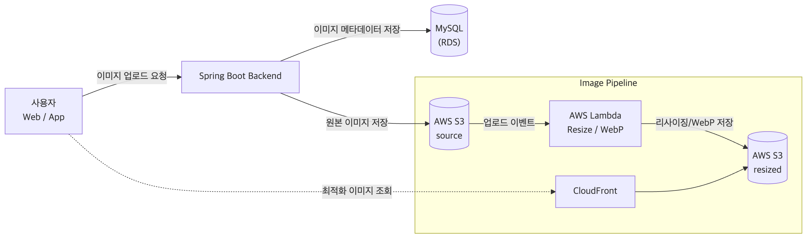

# Toucheese Backend

> 사진관, 스튜디오 공간 대여, 스냅작가를 한 플랫폼에서 검색하고 예약할 수 있도록 만든 촬영 예약 플랫폼 백엔드 프로젝트

Toucheese는 멋사 로켓단 / 샤이닝라이언 파트타임 인턴십 과정에서 진행한 팀 프로젝트입니다.  
사용자가 원하는 촬영 공간과 작가를 탐색하고, 예약, 리뷰, 문의까지 하나의 흐름 안에서 이용할 수 있도록 설계한 서비스입니다.

백엔드는 단순 CRUD 구현을 넘어서,  
**예약 가능 시간 계산**, **회원 인증/인가**, **카카오 로그인**, **관리자 예약 관리**,  
**이미지 업로드 및 최적화**, **무중단 배포 구조**까지 포함한 실제 서비스 운영 관점의 구조를 목표로 개발했습니다.

---

## 목차

- [프로젝트 개요](#프로젝트-개요)
- [인턴십 개요](#인턴십-개요)
- [팀 구성](#팀-구성)
- [프로젝트 방향](#프로젝트-방향)
- [주요 기능](#주요-기능)
- [담당 역할](#담당-역할)
- [기술 스택](#기술-스택)
- [아키텍처](#아키텍처)
- [ERD](#erd)
- [핵심 구현 내용](#핵심-구현-내용)
- [트러블슈팅](#트러블슈팅)
- [프로젝트 결과](#프로젝트-결과)
- [인수인계](#인수인계)
- [API 문서](#api-문서)
- [회고](#회고)

---

## 프로젝트 개요

Toucheese는 사진관, 스튜디오 공간 대여, 스냅작가를 한 플랫폼 안에서 검색하고  
예약까지 이어질 수 있도록 기획된 촬영 예약 플랫폼입니다.

기존 탐색 방식은 정보가 흩어져 있고 광고성 콘텐츠에 의존하는 경우가 많아  
사용자가 실제로 필요한 정보를 빠르게 찾기 어렵다는 문제가 있었습니다.

이 프로젝트는 이러한 문제를 해결하기 위해 아래 흐름을 하나의 서비스로 통합하는 데 집중했습니다.

- 사진관 / 스튜디오 / 스냅작가 검색
- 예약
- 지역 기반 탐색
- 리뷰 및 문의
- 예약 일정 확인

회사 측 요구사항과 일정에 따라 조회 중심 기능을 우선 구현한 뒤, 서비스 흐름을 점진적으로 확장하는 방향으로 프로젝트를 진행했습니다.

---

## 인턴십 개요

### 기본 정보
- **인턴십명**: 멋사 로켓단 / 샤이닝라이언 파트타임 인턴십
- **기간**: 2024.10.02 ~ 2025.01.03
- **형태**: 파트타임 인턴십
- **근무시간**: 오후 1시 ~ 4시
- **회사**: 샤이닝라이언
- **비고**: 인턴십 종료 후 추천서 수령

### 진행 흐름
멋사 KDT 부트캠프 수료 후 멋사 로켓단 인턴십 프로그램에 합류했습니다.  
인턴십 초반에는 회사에서 제시한 과제 3개 중 1개를 선택해 기획을 진행했고,  
이후 멋쟁이사자처럼 기획 대회 1등 팀과 함께할지, 기존 팀 기획으로 진행할지를 선택하는 과정이 있었습니다.

더 많은 경험을 위해 기획팀과 함께 진행하는 방향을 선택했고,  
그 결과 Toucheese 프로젝트를 함께 진행하게 되었습니다.

---

## 팀 구성

### 개발팀
- Java 백엔드 3명
- 프론트엔드 1명
- 안드로이드 2명

### 팀 정보
- **팀명**: Mac-Win
- **내 역할**: 백엔드 팀장

### 디자인 지원
- 샤이닝라이언 소속 디자이너 2명 지원
- 팀 소속 인원은 아니며, 디자인 지원 형태로 협업

### 기획 협업
- 테킷 기획 1등 기획팀과 협업
- 기획팀 5명과 함께 요구사항 논의 및 프로젝트 방향 반영

---

## 프로젝트 방향

Toucheese는 조회 중심 기능을 우선 구현한 뒤,  
추가 요구사항을 반영하는 방식으로 개발이 진행되었습니다.

### 초기 개발 우선순위
- 사진관 / 스튜디오 / 스냅작가 조회
- 검색 기능
- 지역 기반 탐색
- 상세 조회 기능

### 이후 반영한 기능
- 예약
- 문의
- 일정 관리
- 관리자 기능
- 일부 작성 기능

조회 기능을 먼저 안정적으로 구현한 뒤,  
기획팀 요구사항과 일정에 맞춰 확장 가능한 구조로 백엔드를 설계하는 것이 핵심이었습니다.

---

## 주요 기능

### 인증 / 회원
- 일반 회원가입
- 회원탈퇴
- 아이디 찾기
- 비밀번호 재설정
- 카카오 로그인
- JWT 기반 인증 및 인가

### 검색 / 조회
- 검색 기능
- 사진관 / 스튜디오 / 스냅작가 조회
- 조건 기반 조회
- 스튜디오 상세 조회
- 스튜디오 영업시간 조회

### 예약 / 장바구니
- 예약 가능 시간 조회
- 예약 생성
- 예약 정보 저장 비즈니스 로직 처리
- 사용자 예약 조회
- 사용자 예약 수정
- 장바구니 기능

### 리뷰 / 문의
- 리뷰 조회
- 문의 등록 / 조회 / 수정 / 삭제

### 관리자
- 관리자 예약 전체 조회
- 관리자 예약 상태 관리
- 문의 관리

### 기타
- Swagger API 문서화
- 입력값 검증 서비스
- 이미지 업로드 기능
- 이미지 최적화 구조 적용

---

## 담당 역할

프로젝트에서 **백엔드 팀장** 역할을 맡아  
백엔드 개발과 함께 기획팀 요구사항 반영, 개발 방향 조율, 주요 기능 구현을 진행했습니다.

특히 조회 기능 우선 개발 방향 속에서 핵심 백엔드 기능을 구현했고,  
이후 관리자 기능과 일정 관리 등 추가 요구사항도 가능한 범위 내에서 반영했습니다.

### 주요 기여
아래 내용은 프로젝트 전체 기능 중 직접 담당한 영역을 중심으로 정리했습니다.

#### 백엔드 리딩
- 백엔드 3인 팀의 팀장 역할 수행
- 기획팀과 협업하며 요구사항 반영
- 조회 중심 우선 개발 방향에 맞춰 백엔드 개발 진행
- 프로젝트 종료 후 인수인계 진행

#### 사용자 / 인증
- 카카오 로그인 구현
- 일반 회원가입 기능 구현
- 회원탈퇴 기능 구현
- 아이디 찾기 기능 구현
- 비밀번호 재설정 기능 구현
- JWT 기반 인증/인가 적용

#### 예약 / 장바구니
- 예약 정보 저장 비즈니스 로직 구현
- 예약 및 장바구니 기능 구현
- 사용자 예약 조회 및 수정 기능 구현
- 예약 가능한 시간 기능 구현
- 스튜디오 상세 조회 시 영업시간 기능 구현

#### 관리자 / 공통
- 관리자 예약 전체 조회 기능 구현
- 예약 상태 관리 기능 구현
- 검색 기능 구현
- Swagger API 문서화 적용
- 입력값 및 요청 데이터 검증 서비스 구현

#### 이미지 처리
- 이미지 업로드 기능 구현 참여
- 이미지 로딩 속도 개선 작업 참여
- AWS S3, Lambda 기반 이미지 처리 구조를 팀원과 공동 작업

---

## 기술 스택

### Backend
- Java 17
- Spring Boot 3.3.5
- Spring Web
- Spring Data JPA
- Spring Security
- JWT
- QueryDSL
- Validation
- Mail
- WebFlux

### Database
- MySQL

### Infra / Cloud
- AWS S3
- AWS Lambda
- AWS EC2
- AWS RDS
- AWS Route 53
- AWS CloudFront
- AWS CloudWatch
- Docker
- Nginx

### 기타
- Swagger UI
- Solapi
- Lombok

### 협업 / 도구
- Jira
- Swagger
- Discord

---

## 아키텍처

### 1. 전체 서비스 아키텍처

전체 서비스는 클라이언트(웹/안드로이드)와 백엔드로 구성되어 있으며,  
백엔드에서는 RESTful API 기반으로 주요 도메인 데이터 처리와 비즈니스 로직을 담당합니다.

핵심 처리 영역은 아래와 같습니다.

- 회원 인증
- 이미지 업로드
- 예약
- 장바구니
- 리뷰 관리
- 관리자 기능
- API 문서화 및 테스트 환경 제공

인프라는 아래 구조를 중심으로 운영했습니다.

- Spring Boot 기반 서버 구축
- MySQL 사용
- AWS EC2 서버 운영
- AWS RDS 기반 DB 운영
- Route 53으로 가비아 도메인 연결 및 DNS 설정
- Docker와 Nginx를 활용한 무중단 배포 적용

---

### 2. 이미지 처리 아키텍처

이미지 처리 구조는 업로드와 조회를 분리해 설계했습니다.

핵심 흐름은 아래와 같습니다.

1. 사용자가 이미지를 업로드하면 백엔드 API가 요청을 처리합니다.
2. 백엔드는 이미지 메타데이터를 저장하고 원본 이미지를 S3에 업로드합니다.
3. S3 이벤트를 기반으로 AWS Lambda가 호출됩니다.
4. Lambda가 이미지를 리사이징하고 WebP 형식으로 변환합니다.
5. 최적화된 이미지를 S3에 저장합니다.
6. 사용자가 화면에서 이미지를 조회할 때는 CloudFront를 통해 빠르게 전달합니다.

이 구조를 통해 업로드 처리와 이미지 조회 성능을 분리해 최적화할 수 있도록 구성했습니다.

---

## ERD

프로젝트는 회원, 스튜디오, 상품, 예약, 장바구니, 리뷰, 문의, 관리자 기능을 중심으로 데이터를 설계했습니다.

### 핵심 도메인
- Member
- Studio
- Product
- Reservation
- Cart
- Review
- Question

### 모델링 포인트
- 예약은 단순 저장이 아니라 사용자, 스튜디오, 상품, 예약 시간 정보를 함께 다루는 구조로 설계
- 장바구니와 예약 흐름을 연결해 실제 사용자 사용 흐름을 반영
- 이미지 자체는 S3에 저장하고, 애플리케이션에서는 이미지 경로 및 메타데이터를 DB로 관리

---

## 핵심 구현 내용

### 1. 예약 가능 시간 계산 로직
예약 기능은 사용자가 선택한 시간을 그대로 저장하는 구조가 아니라,  
스튜디오 영업시간과 기존 예약 내역을 바탕으로 예약 가능한 시간을 계산한 뒤 저장되도록 구성했습니다.

핵심 처리 흐름은 아래와 같습니다.

- 스튜디오 영업시간 조회
- 기존 예약 정보 조회
- 요청 시간 검증
- 예약 가능 여부 판단
- 예약 저장 또는 예외 응답 처리

이를 통해 단순 CRUD가 아니라  
**도메인 규칙이 반영된 예약 비즈니스 로직**을 구현했습니다.

### 2. 인증 / 인가
Spring Security와 JWT를 기반으로 인증/인가를 구성했습니다.

주요 구현 내용은 아래와 같습니다.

- 일반 회원가입
- 회원탈퇴
- 아이디 찾기
- 비밀번호 재설정
- 카카오 로그인
- 사용자 / 관리자 권한 분리

### 3. 관리자 예약 관리
관리자 기능에서는 예약 전체 조회와 예약 상태 변경 기능을 구현했습니다.

이를 통해 사용자 기능과 별도로  
운영 관점에서 예약 상태를 통제할 수 있는 구조를 만들었습니다.

### 4. 검증 서비스
입력값 검증과 도메인 검증을 분리해,  
단순 DTO 유효성 검사뿐 아니라 예약 생성/수정 시점의 비즈니스 검증도 처리했습니다.

### 5. Swagger 기반 API 문서화
협업 과정에서 API 명세를 빠르게 공유하고 테스트할 수 있도록 Swagger를 적용했습니다.

이를 통해 아래 작업을 더 효율적으로 진행할 수 있었습니다.

- 요청/응답 구조 확인
- 엔드포인트 테스트
- 인증이 필요한 API 검증

---

## 트러블슈팅

### 1. 이미지 로딩 속도와 리사이징 처리 문제

#### 문제
- 이미지 로딩 시간이 길어져 사용자 경험이 저하되었습니다.
- 여러 이미지를 동시에 로딩할 때 페이지가 느려지는 현상이 발생했습니다.

#### 원인
- Imgur에 업로드된 원본 이미지 URL을 직접 사용하는 구조였습니다.
- 원본 이미지 크기가 커 네트워크 전송 속도가 느려졌습니다.
- 외부 이미지 서비스 의존으로 안정성과 제어 한계가 있었습니다.

#### 해결
- Imgur 대신 AWS S3로 이미지 저장소를 이전했습니다.
- S3 이벤트 기반으로 AWS Lambda를 호출했습니다.
- Lambda에서 이미지 리사이징 및 WebP 변환을 수행했습니다.
- 최적화된 이미지를 S3에 저장했습니다.
- CloudFront를 연동해 CDN 기반 이미지 전송을 최적화했습니다.

#### 결과
- **평균 이미지 로딩 속도 60% 이상 개선**
- **WebP 도입으로 이미지 파일 크기 평균 90% 감소**
- 외부 서비스 의존도 감소
- 안정성과 유지 관리 효율 향상

---

### 2. 배포 시 서비스 중단 문제

#### 문제
- 기존 배포 방식에서는 서버 종료 후 새 버전을 실행하는 구조로 인해 서비스 중단이 발생했습니다.
- 배포 과정에서 기존 사용자 요청을 처리할 수 없는 문제가 있었습니다.

#### 원인
- 단일 프로세스 환경으로 운영했습니다.
- Blue-Green Deployment 같은 배포 전략이 적용되지 않았습니다.

#### 해결
- Docker와 Nginx를 연동했습니다.
- 새로운 버전을 컨테이너로 실행한 뒤 Nginx 로드 밸런싱으로 트래픽을 전환했습니다.
- Blue-Green Deployment 방식을 적용했습니다.
- 새 버전을 먼저 테스트한 뒤 트래픽을 전환했습니다.

#### 결과
- 배포 중 서비스 중단 방지
- 기존 사용자 세션 연결 유지
- **배포 시간 20분 → 5분 단축**
- **배포 실패율 0% 유지**

---

## 프로젝트 결과

### 성과
- 3팀 중 **데모데이 발표 팀 선정**
- 최종적으로 **프로덕트 상 수상**
- 프로젝트 이후 해당 서비스를 기반으로 후속 사업 진행
- 웹사이트와 iOS 앱 공개
- 안드로이드 앱 플레이스토어 등록 이력
  - 2026.03.25 기준 안드로이드는 비공개 상태

### 서비스 링크
- 소개 페이지: https://toucheese.vercel.app/
- 웹사이트: https://www.toucheese.net/
- iOS 앱: https://apps.apple.com/kr/app/터치즈/id6742973870
- 안드로이드: 2026.03.25 기준 비공개

---

## 인수인계

인턴십 종료 후 Toucheese 기획팀과 함께  
후속 구현 및 사업 진행을 위한 인수인계를 진행했습니다.

### 인수인계 내용
- 약 1~2개월 정도 인수인계 지원
- AWS, S3, Lambda, EC2, RDS 등 인프라 계정을 내 계정에서 터치즈 팀 기획대표 계정으로 이관 지원
- 코드 관련 질문 대응
- 개발 과정에서 막히는 부분에 대한 답변 및 지원 진행

이 과정을 통해 단순 개발 참여를 넘어  
**후속 운영팀이 서비스를 이어받을 수 있도록 연결하는 경험**까지 할 수 있었습니다.

---

## API 문서

배포된 Swagger UI를 통해 주요 API를 바로 확인할 수 있습니다.

- `https://toucheese.j-cheol.cloud/swagger-ui/index.html`

---

## 회고

이 프로젝트는 부트캠프 이후 실제 인턴십 환경에서 수행한 프로젝트였고,  
단순히 기능을 구현하는 수준을 넘어 **협업, 운영, 인수인계까지 연결된 경험**이라는 점에서 의미가 컸습니다.

특히 아래 경험이 중요했습니다.

### 1. 실무형 협업 경험
인턴십 환경에서 기획팀, 개발팀, 후속 운영팀과 연결되는 구조를 경험했습니다.

### 2. 백엔드 팀장 경험
백엔드 3명 중 팀장 역할을 맡아  
백엔드 개발뿐 아니라 조율과 방향 반영까지 함께 수행했습니다.

### 3. 서비스 출시 및 후속 운영 연결 경험
데모데이 이후 실제 후속 사업이 진행되었고,  
웹 및 iOS 공개 이후 인수인계까지 참여했습니다.

### 4. 인프라 및 운영 경험
AWS 기반 운영 구조를 경험했고,  
인프라 이관 지원과 무중단 배포, 이미지 최적화 등 운영 관점의 경험도 함께 쌓을 수 있었습니다.

---

## 한 줄 요약

샤이닝라이언 파트타임 인턴십에서 백엔드 팀장으로 참여해 촬영 예약 플랫폼 Toucheese 개발, 데모데이 선정, 프로덕트 상 수상, 인프라 인수인계까지 경험했습니다.